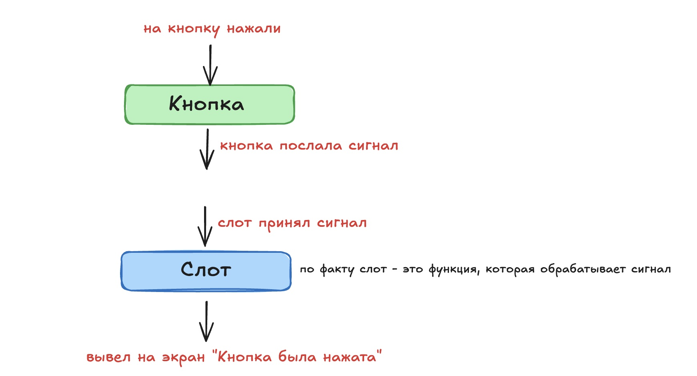

## Что такое PyQt6

**_PyQt6_** — это библиотека для создания графических интерфейсов на Python, основанная на фреймворке Qt 6. Она позволяет создавать полнофункциональные приложения с окнами, кнопками, таблицами, формами и другими элементами интерфейса.

## Основные понятия PyQt6

a) **_QApplication_**

- Центральный объект любого приложения PyQt6
- Отвечает за:

    - Главный цикл обработки событий (event loop)
    - Управление стилями и темами
    - Глобальные настройки приложения

Пример создания:

```python
from PyQt6.QtWidgets import QApplication

app = QApplication([])
```

b) **_QWidget_**

- Базовый класс всех элементов интерфейса (окна, панели, кнопки, поля ввода)
- Можно использовать как пустое окно или как контейнер для других виджетов
- От него наследуются все пользовательские компоненты

Пример:
```python
from PyQt6.QtWidgets import QWidget

window = QWidget()
window.setWindowTitle("Пример окна")
window.show()
```

c) **_Layouts (Лейауты)_**

Лейауты управляют размещением виджетов на экране.

Основные типы:

- _QVBoxLayout_ — вертикальное расположение (сверху вниз)
- _QHBoxLayout_ — горизонтальное расположение (слева направо)
- _QGridLayout_ — сетка
- _QStackedLayout_ — переключение между страницами

**Горизонтальный лейаут**


**Вертикальный лейаут**


Пример:
```python
from PyQt6.QtWidgets import QVBoxLayout, QPushButton

layout = QVBoxLayout()
layout.addWidget(QPushButton("Кнопка 1"))
layout.addWidget(QPushButton("Кнопка 2"))
```


d) **_Сигналы и слоты_**

- _Сигнал_ — уведомление о событии (например, клик кнопки)
- _Слот_ — функция, которая выполняется при сигнале. Например, после клика на кнопку, нам нужно что-то предпринять Например, вывести на экран, что кнопка была нажата
- _Подключение_ — связывает сигнал с определенным слотом

```python
from PyQt6.QtWidgets import QPushButton

def on_click():
    print("Кнопка нажата")

button = QPushButton("Нажми меня")
button.clicked.connect(on_click)
```

**Пример того, как работает связка сигналов и слотов**




e) **_Работа с потоками (QThread)_**

- Основной поток отвечает за интерфейс, поэтому тяжелые операции (HTTP запросы, обработка файлов) нужно выполнять в отдельном потоке
- QThread позволяет запускать фоновую работу без блокировки интерфейса
- Для безопасного обмена данными между потоками используются сигналы

```python
from PyQt6.QtCore import QThread, pyqtSignal
import time

class Worker(QThread):
    finished = pyqtSignal(str) # создаем свой сигнал

    def run(self):
        time.sleep(2)  # Долгая операция
        self.finished.emit("Готово!") # по завершению работы потока, шлем сигнал

worker = Worker()
worker.finished.connect(lambda msg: print(msg)) # ловим сигнал и выводим сообщение 
worker.start() # запускаем поток
```

f) **_QPixmap_**

- Класс для работы с изображениями в PyQt6
- Позволяет загружать, масштабировать и отображать изображения в виджетах типа QLabel

```python
from PyQt6.QtWidgets import QLabel
from PyQt6.QtGui import QPixmap

label = QLabel()
pixmap = QPixmap("cat.jpg")
label.setPixmap(pixmap)
label.setScaledContents(True)  # Масштабирование под размер виджета
```
