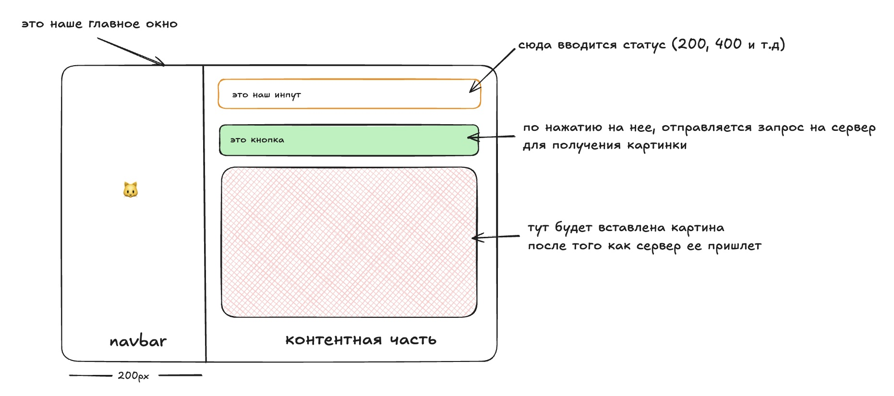
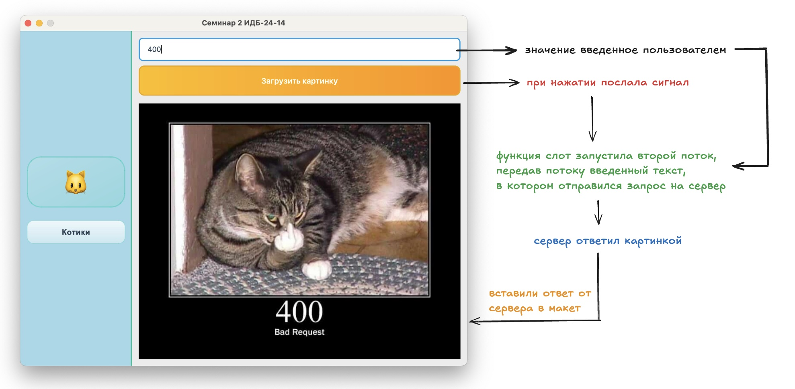

# Методичка по созданию GUI приложения на PyQt6

## Введение

В этой методичке мы пошагово создадим GUI приложение с использованием библиотеки PyQt6. Наше приложение будет состоять из навигационной панели и контентной области, где пользователь сможет загружать изображения котиков по HTTP коду состояния.

## Содержание

1. [Подготовка проекта](#подготовка-проекта)
2. [Создание базового окна](#создание-базового-окна)
3. [Разработка навигационной панели](#разработка-навигационной-панели)
4. [Создание контентной страницы](#создание-контентной-страницы)
5. [Работа с потоками и HTTP запросами](#работа-с-потоками-и-http-запросами)
6. [Отображение изображений](#отображение-изображений)

---

## Подготовка проекта

### Шаг 1: Создание структуры проекта

1. **Создайте новую папку** для проекта
2. **Откройте папку** в редакторе/IDE (VS Code, PyCharm и т.д.)
3. **Создайте виртуальное окружение:**
   ```bash
   python3 -m venv venv
   ```
4. **Активируйте виртуальное окружение:**
   ```bash
   source venv/bin/activate
   ```

### Шаг 2: Установка зависимостей

1. **Установите необходимые библиотеки:**
   ```bash
   pip install PyQt6 requests watchdog
   ```

2. **Зафиксируйте зависимости:**
   ```bash
   pip freeze > requirements.txt
   ```

3. **Для будущих запусков используйте:**
   ```bash
   pip install -r requirements.txt
   ```

### Шаг 3: Создание файлов проекта

Создайте следующие файлы:

- `main.py` — точка входа в приложение
- `navbar.py` — навигационная панель
- `page.py` — контентная страница
- `styles.py` — стили для интерфейса
- `api.py` — константы для API
- `run.py` - файл для автоматического хот релоада (по желанию)

---

## Макет проекта и его составляющие


## Основной принцип работы



## Создание базового окна

### Основные компоненты PyQt6

Перед началом разработки важно понимать базовые компоненты:

#### **QApplication**
- **"Сердце приложения"** — без него окно не появится
- Отвечает за:
    - Обработку событий (клики мыши, нажатия клавиш)
    - Управление циклом программы
    - Глобальные настройки (тема, шрифты, стили)

#### **QWidget**
- **Базовый элемент интерфейса** — окна, кнопки, поля ввода
- Может быть пустым окном или содержать другие виджеты
- Основа для создания пользовательских компонентов

### Создание главного окна

Создайте файл `main.py`:

```python
import sys
from PyQt6.QtWidgets import QApplication, QWidget, QHBoxLayout
from PyQt6.QtCore import Qt
from navbar import Navbar
from page import Page

class MainWindow(QWidget):
    def __init__(self):
        super().__init__()
        self.setWindowTitle("Семинар 2 ИДБ-24-14")
        
        # Создаем горизонтальный лейаут
        main_layout = QHBoxLayout(self)
        
        # Создаем компоненты
        navbar = Navbar()
        content = Page()
        
        # Добавляем компоненты в лейаут
        main_layout.addWidget(navbar)
        main_layout.addWidget(content)
        
        # Убираем отступы и промежутки
        main_layout.setSpacing(0)
        main_layout.setContentsMargins(0, 0, 0, 0)

if __name__ == "__main__":
    # Создаем приложение
    app = QApplication([])
    
    # Создаем и настраиваем окно
    window = MainWindow()
    window.setFixedSize(800, 600)
    window.show()
    
    # Запускаем главный цикл событий
    sys.exit(app.exec())
```

### Объяснение кода

- **`sys`** — нужен для корректного завершения программы
- **`super().__init__()`** — вызываем конструктор родительского класса
- **`app.exec()`** — запускает цикл обработки событий
- **`sys.exit(...)`** — обеспечивает корректное завершение программы

---

## Разработка навигационной панели

### Создание базовой структуры

Создайте файл `navbar.py`:

```python
from PyQt6.QtWidgets import QWidget, QVBoxLayout, QLabel
from PyQt6.QtCore import Qt
import styles

class Navbar(QWidget):
    def __init__(self):
        super().__init__()
        
        # Создаем вертикальный лейаут
        layout = QVBoxLayout(self)

        # Добавляем растягивающий элемент для центрирования
        layout.addStretch()
        
        # Создаем элементы навбара
        icon = QLabel("🐱")
        text = QLabel("Котики")
        
        # Применяем стили
        icon.setStyleSheet(styles.navbar_icon)
        text.setStyleSheet(styles.navbar_text)
        
        # Добавляем элементы в лейаут
        layout.addWidget(icon)
        layout.addWidget(text)
        
        # Добавляем растягивающий элемент для центрирования
        layout.addStretch()
        
        # Настройки навбара
        self.setFixedWidth(200)
        self.setObjectName("navWidget")
        self.setAttribute(Qt.WidgetAttribute.WA_StyledBackground, True)
        self.setStyleSheet(styles.base_navbar)
```

### Создание файла стилей

Создайте файл `styles.py`:

```python
# Стили для навигационной панели
base_navbar = """
#navWidget {
    background-color: #2c3e50;
    border-right: 2px solid #34495e;
}
"""

navbar_icon = """
QLabel {
    font-size: 24px;
    color: white;
    padding: 10px;
    text-align: center;
}
"""

navbar_text = """
QLabel {
    font-size: 16px;
    color: #ecf0f1;
    padding: 5px 10px;
    font-weight: bold;
}
"""

# Стили для контентной области
input_status = """
#statusInput {
    padding: 10px;
    font-size: 14px;
    border: 2px solid #3498db;
    border-radius: 5px;
    background-color: white;
    margin: 10px;
}

#statusInput:focus {
    border-color: #2980b9;
    outline: none;
}
"""

load_buttons = """
QPushButton {
    background-color: #3498db;
    color: white;
    border: none;
    padding: 12px 24px;
    font-size: 14px;
    font-weight: bold;
    border-radius: 5px;
    margin: 10px;
}

QPushButton:hover {
    background-color: #2980b9;
}

QPushButton:pressed {
    background-color: #21618c;
}

QPushButton:disabled {
    background-color: #95a5a6;
    color: #7f8c8d;
}
"""
```

### Объяснение стилизации

- **`setObjectName("navWidget")`** — устанавливает ID для CSS-селектора
- **`setAttribute(Qt.WidgetAttribute.WA_StyledBackground, True)`** — позволяет применять стили к фону
- **`layout.addStretch()`** — добавляет растягивающийся элемент для центрирования контента

---

## Создание контентной страницы

### Базовая структура страницы

Создайте файл `page.py`:

```python
from PyQt6.QtWidgets import QWidget, QVBoxLayout, QLabel, QPushButton, QLineEdit
from PyQt6.QtCore import QThread, pyqtSignal
from PyQt6.QtGui import QPixmap
import requests
import styles
import api

class Page(QWidget):
    def __init__(self):
        # Вызываем конструктор родительского класса QWidget
        super().__init__()

        # Создаем вертикальный лейаут для размещения элементов сверху вниз
        layout = QVBoxLayout(self)

        # === СОЗДАНИЕ ЭЛЕМЕНТОВ ИНТЕРФЕЙСА ===

        # Создаем поле ввода для статуса HTTP ответа
        self.input = QLineEdit()
        self.input.setPlaceholderText("Введите статус ответа")  # Подсказка в поле
        self.input.setObjectName("statusInput")  # ID для CSS стилей
        self.input.setStyleSheet(styles.input_status)  # Применяем стили к полю ввода

        # Создаем кнопку для запуска загрузки изображения
        self.button = QPushButton("Загрузить картинку")
        self.button.setStyleSheet(styles.load_buttons)  # Применяем стили к кнопке

        # Создаем виджет-метку для отображения загруженного изображения
        self.image_label = QLabel("")
        self.image_label.setScaledContents(True)  # Масштабируем изображение под размер виджета

        # === ДОБАВЛЕНИЕ ЭЛЕМЕНТОВ В ЛЕЙАУТ ===

        # Добавляем все созданные элементы в вертикальный лейаут
        layout.addWidget(self.input)      # Поле ввода вверху
        layout.addWidget(self.button)     # Кнопка в середине  
        layout.addWidget(self.image_label)  # Область изображения внизу

        # === ПОДКЛЮЧЕНИЕ СИГНАЛОВ К СЛОТАМ ===

        # Подключаем сигнал клика кнопки к методу загрузки изображения
        # При клике на кнопку будет вызван метод load_image()
        self.button.clicked.connect(self.load_image)

    def load_image(self):
        """Слот для обработки клика по кнопке загрузки"""

        # Получаем текст из поля ввода (статус HTTP)
        text = self.input.text()

        # === ИЗМЕНЕНИЕ СОСТОЯНИЯ ИНТЕРФЕЙСА ===

        # Блокируем кнопку чтобы предотвратить повторные клики
        self.button.setEnabled(False)
        # Меняем текст кнопки для показа процесса загрузки
        self.button.setText("Идет загрузка...")

        # === ЗАПУСК ЗАГРУЗКИ В ОТДЕЛЬНОМ ПОТОКЕ ===

        # Создаем экземпляр потока для загрузки изображения
        # Передаем введенный статус в конструктор
        self.thread = ImageLoader(text)

        # Подключаем сигнал завершения потока к методу отображения
        # Когда поток закончит работу, вызовется display_image()
        self.thread.finished.connect(self.display_image)

        # Запускаем поток (начинает выполняться метод run() в ImageLoader)
        self.thread.start()

    def display_image(self, data: bytes):
        """Слот для отображения загруженного изображения
        
        Args:
            data (bytes): Данные изображения в виде байтов
        """

        # === ПРЕОБРАЗОВАНИЕ ДАННЫХ В ИЗОБРАЖЕНИЕ ===

        # Создаем объект QPixmap для работы с изображением
        pixmap = QPixmap()

        # Загружаем данные изображения из массива байтов
        # loadFromData автоматически определяет формат (JPEG, PNG и т.д.)
        pixmap.loadFromData(data)

        # === ОТОБРАЖЕНИЕ ИЗОБРАЖЕНИЯ В ИНТЕРФЕЙСЕ ===

        # Устанавливаем изображение в виджет-метку
        # Благодаря setScaledContents(True) изображение масштабируется
        self.image_label.setPixmap(pixmap)

        # === ВОССТАНОВЛЕНИЕ СОСТОЯНИЯ ИНТЕРФЕЙСА ===

        # Разблокируем кнопку после завершения загрузки
        self.button.setEnabled(True)
        # Возвращаем исходный текст кнопки
        self.button.setText("Загрузить картинку")
```

### Создание файла API констант

Создайте файл `api.py`:

```python
# API endpoints
CAT_URL = "https://http.cat/"
```

---

## Работа с потоками и HTTP запросами

### Концепция сигналов и слотов

В PyQt используется система **сигналов и слотов** для обработки событий:

- **Сигнал** — уведомление о том, что произошло событие
- **Слот** — функция, которая выполняется при получении сигнала
- **Подключение** — связь между сигналом и слотом

### Создание класса для загрузки изображений

Добавьте в файл `page.py` класс `ImageLoader`:

Image Loader - это класс для загрузки изображений в отдельном потоке.

Он наследуется от QThread, что позволяет выполнять HTTP запросы в фоновом режиме без блокировки пользовательского интерфейса.

```python
class ImageLoader(QThread):
    def __init__(self, text: str):
        """
        Конструктор потока загрузки изображения
        
        Args:
            text (str): HTTP статус код для формирования URL запроса
        """
        # Вызываем конструктор родительского класса QThread
        super().__init__()

        # Сохраняем переданный текст (статус код) как атрибут экземпляра
        # Будет использоваться в методе run() для формирования URL
        self.text = text


    # Создаем сигнал, который будет испущен при успешной загрузке
    # pyqtSignal(bytes) означает, что сигнал передает данные типа bytes
    # Этот сигнал подключается к слоту display_image() в основном классе
    finished = pyqtSignal(bytes)

    def run(self):
        """
        Основной метод потока, выполняется в фоновом режиме.
        
        Этот метод автоматически вызывается при старте потока (thread.start()).
        Здесь происходит HTTP запрос и обработка ответа.
        """

        # === ВЫПОЛНЕНИЕ HTTP ЗАПРОСА ===

        # Формируем полный URL, объединяя базовый URL API и статус код
        # Например: "https://http.cat/" + "404" = "https://http.cat/404"
        url = api.CAT_URL + self.text

        # Отправляем GET запрос к сформированному URL
        # requests.get() - синхронный вызов, который может занять время
        # Поэтому мы выполняем его в отдельном потоке
        response = requests.get(url)

        # Проверяем успешность запроса по статус коду
        # 200 означает "OK" - запрос выполнен успешно
        if response.status_code == 200:

            # Испускаем сигнал finished с данными изображения
            # response.content содержит байты загруженного изображения
            # Этот сигнал "долетит" до основного потока и вызовет display_image()
            self.finished.emit(response.content)
```
_ПРИМЕЧАНИЕ:_ 

В реальном приложении здесь стоит добавить обработку ошибок:

- Проверка других статус кодов (404, 500 и т.д.)
- Обработка исключений requests (timeout, connection error)
- Испускание сигнала об ошибке для уведомления пользователя

### Почему используются потоки?

- **Основной поток** отвечает за интерфейс пользователя
- **HTTP запросы** могут занимать время и "заморозить" интерфейс
- **QThread** позволяет выполнять длительные операции в фоне
- **Сигналы** обеспечивают безопасную связь между потоками

---

## Отображение изображений

### Работа с QPixmap

**QPixmap** — специализированный класс PyQt для работы с изображениями:

- Оптимизирован для отображения в GUI
- Поддерживает множество форматов изображений
- Автоматически масштабируется под размер виджета

### Процесс загрузки и отображения

1. **Получение данных** — HTTP запрос возвращает байты изображения
2. **Создание QPixmap** — преобразование байтов в объект изображения
3. **Установка в QLabel** — отображение изображения в интерфейсе

```python
def display_image(self, data: bytes):
    """Процесс отображения изображения"""
    # Создаем объект изображения
    pixmap = QPixmap()
    
    # Загружаем данные изображения из байтов
    pixmap.loadFromData(data)
    
    # Устанавливаем изображение в виджет
    self.image_label.setPixmap(pixmap)
    
    # Восстанавливаем состояние кнопки
    self.button.setEnabled(True)
    self.button.setText("Загрузить картинку")
```

---

## Запуск приложения

### Финальная структура проекта

```
project_folder/
│
├── venv/                 # Виртуальное окружение
├── main.py              # Точка входа
├── run.py               # Файл для хот релоада
├── navbar.py            # Навигационная панель
├── page.py              # Контентная страница
├── styles.py            # Стили приложения
├── api.py               # API константы
└── requirements.txt     # Зависимости
```

### Команды для запуска

1. **Активируйте виртуальное окружение:**
   ```bash
   source venv/bin/activate
   ```

2. **Установите зависимости (если нужно):**
   ```bash
   pip install -r requirements.txt
   ```

3. **Запустите приложение:**
   ```bash
   python main.py
   ```

---

### Полезные ресурсы

- [Официальная документация PyQt6](https://doc.qt.io/qtforpython-6/)
- [Qt Designer](https://doc.qt.io/qt-6/qtdesigner-manual.html) — визуальный редактор интерфейсов

### Содержимое файла run.py
```python
import subprocess
from watchdog.observers import Observer
from watchdog.events import FileSystemEventHandler
import time
import sys

class ReloadHandler(FileSystemEventHandler):
    def __init__(self, script):
        super().__init__()
        self.script = script
        self.process = None
        self.start_process()

    def start_process(self):
        if self.process:
            self.process.terminate()
        self.process = subprocess.Popen([sys.executable, self.script])

    def on_modified(self, event):
        if event.src_path.endswith(".py"):
            print("Перезапуск...")
            self.start_process()

if __name__ == "__main__":
    script = "main.py"
    event_handler = ReloadHandler(script)
    observer = Observer()
    observer.schedule(event_handler, ".", recursive=False)
    observer.start()

    try:
        while True:
            time.sleep(1)
    except KeyboardInterrupt:
        observer.stop()
    observer.join()
```

### Ссылка на GitHub проекта
[Github | PyQt Memes](https://github.com/ianaomalova/PyQT-memes)
