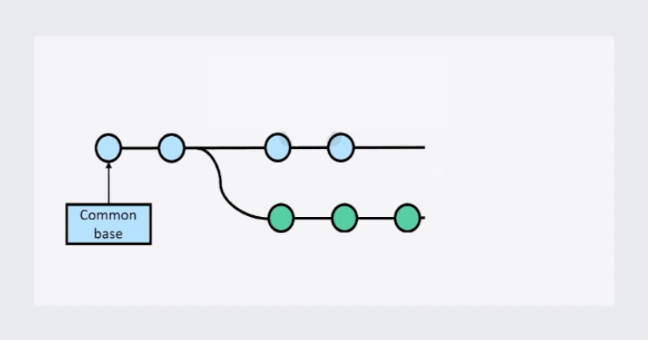
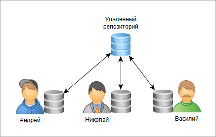

# Основные понятия Git

### Репозиторий (repo)
Это папка, в которой Git хранит проект и его историю. 

Представьте себе чемоданчик, в котором лежит весь ваш проект и его история.

- **Локальный репозиторий** — чемоданчик у вас дома на компе.
- **Удалённый репозиторий** — чемоданчик в облаке (например, на GitHub), куда можно заглянуть и другим.

### Stage area (или staging area, или index)
Это промежуточная зона между вашими изменениями в файлах и самим коммитом.

В Git есть три “уровня хранения” кода:

1.	Working Directory (рабочая папка)
→ здесь вы редактируете файлы на компьютере.

2.	Staging Area (index)
→ сюда попадают изменения, которые вы отметили с помощью git add.

3.	Repository (локальный репозиторий)
→ это история коммитов, то, что уже навсегда (почти) записано в Git.

### Коммит (commit)
Сохранённая версия проекта с описанием изменений. Это как сделать **фотографию проекта** 📷

Вы сохраняете снимок того, как выглядит ваш код в данный момент, и подписываете его:  
*"Добавил кнопку входа"* или *"Исправил баг с котиками"*.

Это позволяет всегда вернуться к старому фото, если новое вышло кривым.

### Ветка (branch)
Ветки — это как **параллельные версии** вашего проекта.
Вы можете сделать несколько веток
работы над проектом. Например, в главной ветке у вас будет стабильно
работающая версия кода. Вы можете сделать некую параллельную копию main
и писать код в этой ветке, не боясь повредить стабильно работающую версию

### Merge (слияние)
Берём код из одной ветки и аккуратно объединяем его с другой.  
Например: *"берём классные фичи из `dev` и добавляем их в `main`"*.

Взяли стакан с вод(к)ой и добавили в него сок. 

### Push/Pull
- **Push** — это как выложить свои фотки в Instagram: код был у вас локально, а теперь улетел в интернет (на GitHub).
- **Pull** — это наоборот: вы тянете свежие фотки из Instagram себе в телефон. Если группаш запостил новый код — вы его забираете.  

