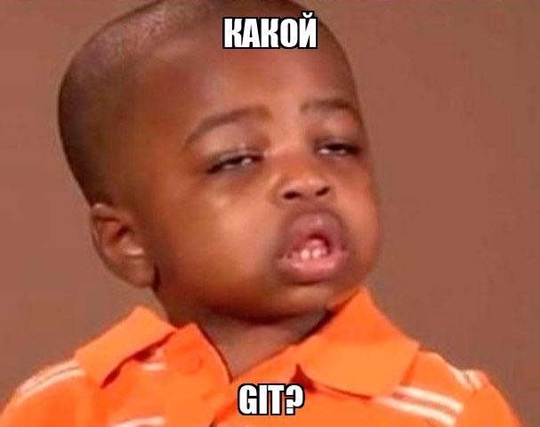
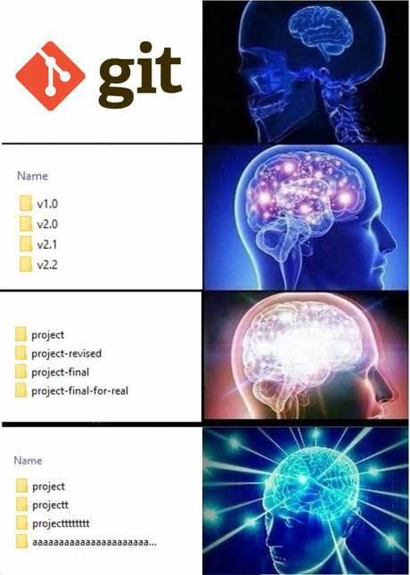

# :material-git: Что такое Git и зачем он нужен?


**Git** - _это система контроля версий (система для отслеживания изменений в файлах)_

Представьте, что вы делаете лабу по ОП пишете невероятно сложный код:
```python
def sum (a, b):
    print (a + b)
    
sum(1, 2)
```
Это ваша первая версия кода (файла)

После чего, душный преподаватель требует, 
чтобы вы не печатали значение функции на экране, 
а возвращали его из функции, и вы переписываете код следующим образом:
```python
def sum (a, b):
    return a + b
    
print(sum(1, 2))
```
Это ваша вторая версия файла

А теперь представьте, что душный преподаватель передумал и сказал: "Хотя нет, верни как было в 1й раз"

А дальше представьте, что код, который вы писали, был не 4 строки кода, а 400. И так как вы не сохраняли прошлую
версию файла, то вам придется вручную заново вспоминать и писать все эти 400 строк кода.

Звучит больно, но если вы предусмотрительный студент, то вы могли взять и сохранить у себя где-то первую версию кода.

Какие варианты для этого могут быть?

Первый, самый банальный: это сделать дубликат файла и писать новую версию кода в копии, а оригинал оставить как есть

Второй - это если вы шарите и используете ту самую, систему контроля версий Git. Теперь вам не нужно вручную копировать
и плодить 100500 версий папок и файлов. Вы делегируете эту задачу гиту, который может
"фотографировать" каждую новую версию файла, даже если таких версий будут тысячи. 

В свою очередь, вы сможете через удобные инструменты 
смотреть на все эти версии, откатываться к прошлым версиям и работать в команде (об этом поговорим чуть позже)

Итого каким сверхразумом быть в своих проектах выбор за вами, но на ПП придется сквозь боль и слезы остановиться на первом варианте: 


