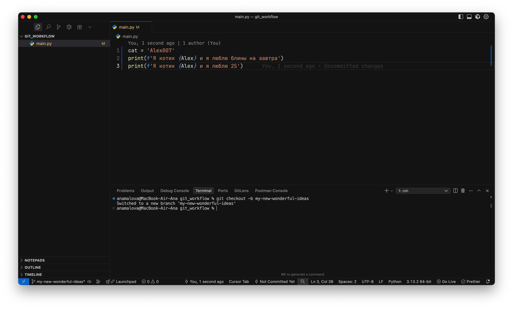

# Как работает слияние и как работать с ветками

Представим, что Егор Б. осознал, что опасно писать код сразу в главной ветке. Ему нужно создать какую-то копию текущего проекта, но чтобы изменения не ломали главную, стабильно работающую ветку.

Для этого Егор Б., используя команду `git checkout -b my-new-wonderful-ideas` создает новую ветку и сразу на нее переключается:

Теперь он вносит изменения в файл, меняет имя котика и его поведение:

По старой схеме зальем изменения на удаленный репозиторий и посмотрим на результат в GitHub

В результате у нас появилась новая ветка, с названием `my-new-wonderful-ideas`, в которой 3 коммита:

- первые 2 были взяты из ветки main в момент создания новой ветке
- третий коммит мы сделали только что

При этом в ветке main по-прежнему 2 коммита

Что делать, если мы хотим, чтобы изменения из новой ветки добавились в главную ветку?

Для этого выполняется 2 шага:

- Сначала нам нужно вернуться в ту ветку, в которую мы планируем влить изменения. В нашем случае - это ветка main.
  Делаем `git checkout main`
- После чего вливаем изменения из новой ветки в main: `git merge my-new-wonderful-ideas`

Снова пушим изменения в удаленный репозиторий и смотрим, что стало с веткой main

Видим, что теперь ветка main также содержит тот самый 3й коммит, который мы делали в другой ветке:

Но помните, что если 2 ветки какое-то время разрабатывались параллельно и меняли содержимое одних и тех же файлов, то мердж этих веток 
может быть крайне болезненным.

