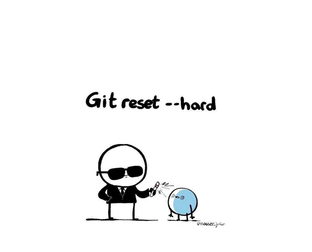

# Что делать если последний комит все сломал на проде и нужно откатиться

Внезапно, Егор Б. осознал, что перепутал 54 и 25 и отправил в гит строку, что оказывается, он любит 25. Что делать?

Откатить изменения!

### Reset'ы

Формально есть 3 варианта это сделать:

#### `git reset --soft HEAD~1`

Эта команда откатывает коммит, но сохраняет все изменения в staging (индексе).

- История перематывается на коммит назад
- Файлы остаются отмеченными как “готовые к коммиту”
- Удобно, если нужно переделать коммит (например, исправить сообщение или добавить ещё изменения)

#### `git reset --mixed HEAD~1` (используется по умолчанию)

Эта команда откатывает коммит и сохраняет изменения только в рабочей папке (working directory), но убирает их из staging.

- История перематывается
- Изменения в файлах остаются, но они как будто только что сделаны, не добавлены в индекс
- Удобно, если хочется переписать коммит, но самому решить, что снова добавлять в git add

#### `git reset --hard HEAD~1`

Самый жёсткий вариант — полный откат.

- История перематывается
- Изменения в staging и в файлах удаляются
- Рабочая папка возвращается в состояние выбранного коммита
- 🛑 Всё, что не закоммичено, исчезнет навсегда

Все три варианта reset (--soft, --mixed, --hard) меняют только локальную историю. То есть ветка у тебя на компе сдвигается на старый коммит, а на GitHub (или GitLab) пока остаётся как была.

Что делать, чтобы заставить историю переписаться и на сервере?

Ответ:

**Но помните, если вы работаете не одни, то если кто-то уже успел забрать старую ветку и сделать свои коммиты, при следующем git pull у них начнётся ад с конфликтами**

### Revert

Когда переписывать историю опасно (особенно если проект общий и на проде), то вместо этого можно использовать `git revert`

В отличие от `reset`, он не стирает старый коммит, а создаёт новый, который отменяет изменения из выбранного

Итог:

- Если Егор Б. опозорился локально — можно сделать reset
- Если опозорился на проде и все уже увидели его любовь к 25 — лучше revert

Но если он не хочет, чтобы история помнила его позор, то делаем reset hard:

После этого и локальная история, и история на сервере забудут про любовь Егора Б. к 25

