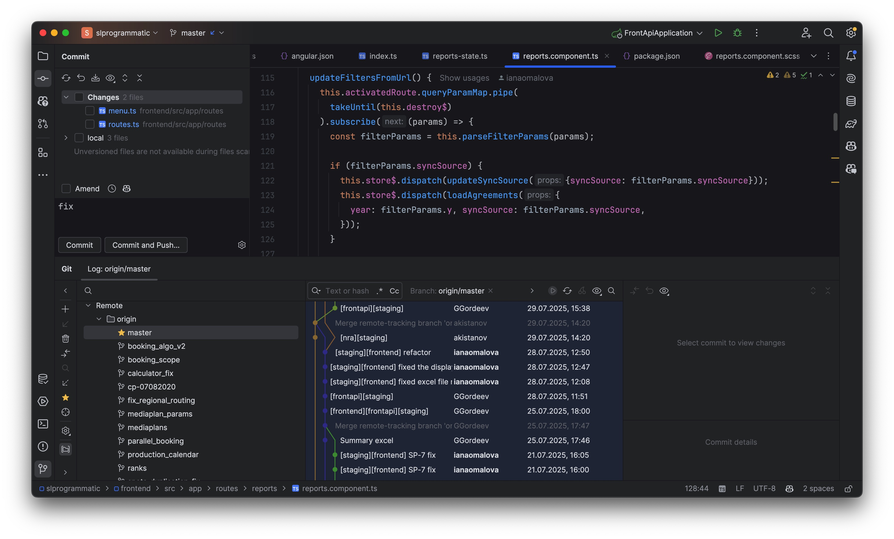
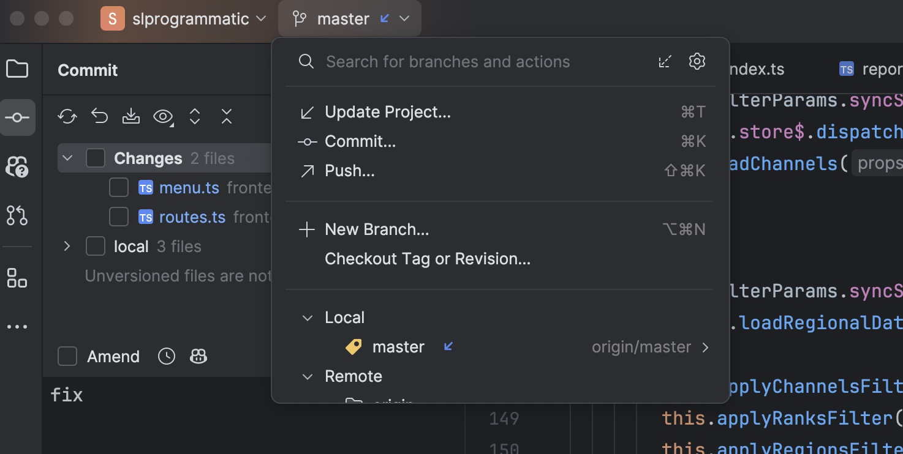
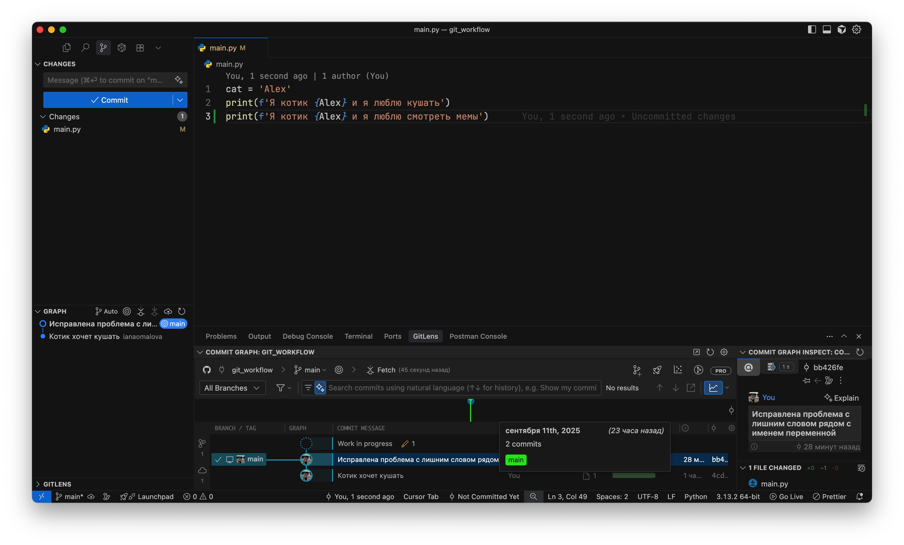
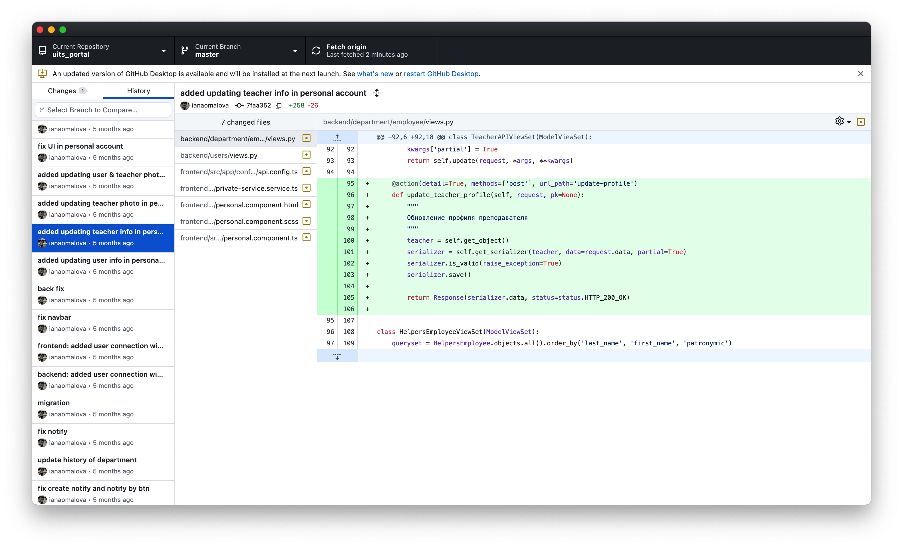
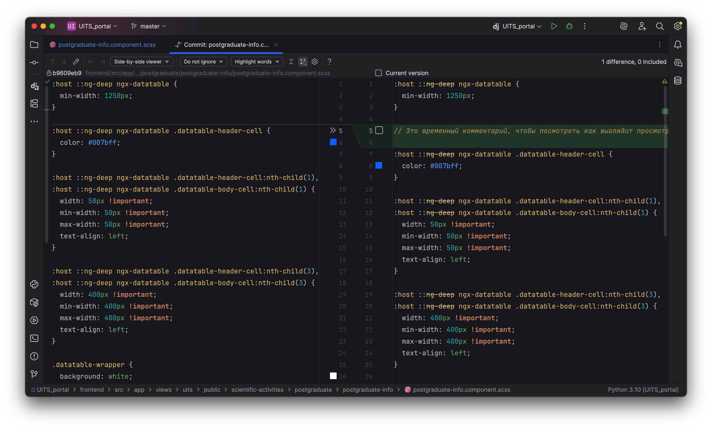
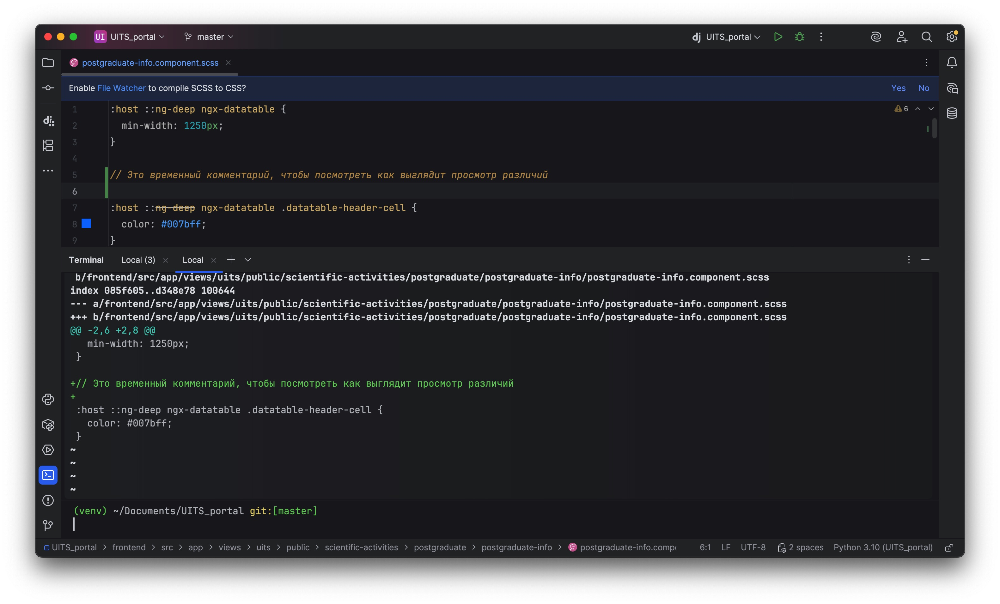

# :material-tools: Как можно пользоваться гитом?

На самом деле помимо ввода команд в консоли, можно использовать различные UI инструменты.

### Инструменты JetBrains

Например, среды разработки от JetBrains имеют очень удобный визуал для работы с гитом:

Слева сверху отображаются файлы, которые были изменены. Выбором чекбоксов и вводом текста, можно закоммитить файлы без необходимости ввода команд в консоль.

Снизу отображаются ветки проекта и коммиты, сделанные в текущей ветке.

Запушить или обновить проект можно также через UI:

### Инструменты VSCode

Редакторы кода наподобие VSCode также имеют UI для работы с гитом:

Слева отображаются встроенные функции работы с гитом, снизу дополнительное бесплатное расширение **GitLens**

### Десктопные решения

Также есть различные десктопные приложения, например GitHub Desktop:

Выбор каким по итогу решением пользоваться за вами

### Diff

При этом в UI инструментах присутствует удобный просмотр изменений по текущему файлу. Например, JetBrains:

Подобное можно посмотреть и в консоли, однако это менее наглядно:

