# :octicons-workflow-16: Жизненный цикл работы с Git

Рассмотрим как выглядит типичная работа с гитом:


Некий Егор Б. решил написать комикс про кота.

### Создание проекта

Для этого первым делом он создал проект в IDE (например, PyCharm), либо редакторе кода (например, VS Code), в котором добавил нужные файлы

Т.е теперь у вас есть папка с каким-то количеством вложенных файлов/папок. Выглядит это следующим образом:
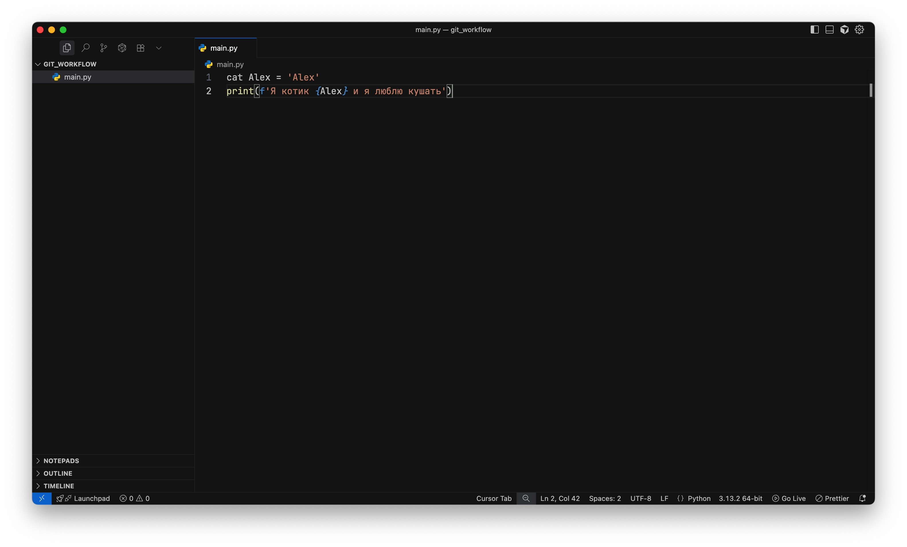

**P.S Пока что не обращайте внимание на лишнее слово Alex рядом с именем переменной**

На этом этапе у вас **нет** никакого Git репозитория, вам его нужно создать. Делается это командой `git init`.

### Инициализация репозитория (git init)

Находясь в корневой папке проекта, откройте терминал, введите команду `git init` и нажмите Enter:

После этого действия в терминале вы увидите сообщение, о том что репозиторий инициализирован и файлы окрасятся в зеленый цвет:
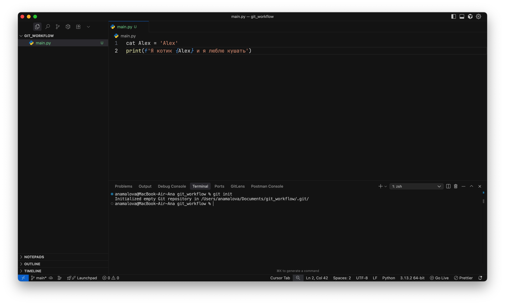

Давайте посмотрим статус:
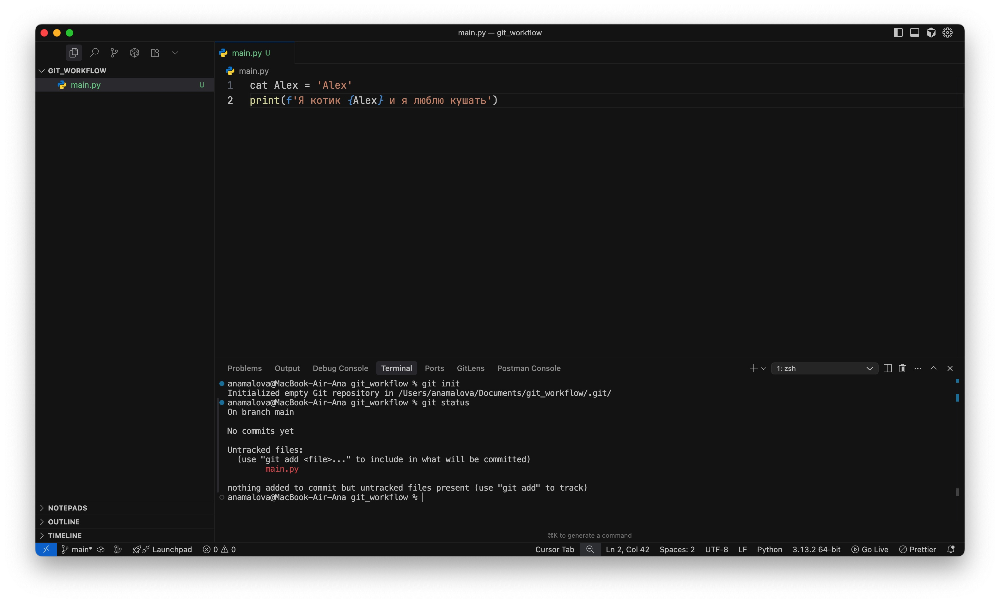

Состояний может быть несколько:

- **Untracked (Неотслеживаемые)**

Файл есть в папке, но Git о нём ничего не знает. Это значит, что или вы добавили новый файл и забыли сказать гиту "следи за ним", или вы намеренно его не отслеживаете (такое тоже имеет место быть)

Это можно сравнить как если бы к вам в клуб юных списывальщиков пришел новый человек и вам нужно его представить. О нем еще никто не знает

В такой ситуации команда `git status` скажем вам:

```bash
Untracked files:
  (use "git add <file>..." to include in what will be committed)
```

➡️ Нужно добавить через git add, если хотите, чтобы Git его отслеживал.

- **Modified (Изменённые)**

Файл уже отслеживается Git, но вы внесли изменения, которые ещё не добавлены в индекс.

Сравнимо с тем, если человек в клубе юных списывальщиков сменил прическу, вы уже о нем знаете, но надо "обновить" инфу, что
у него теперь новая прическа

Вывод команды `git status`:

```bash
Changes not staged for commit:
  (use "git add <file>..." to update what will be committed)
```

➡️ Чтобы сохранить изменения в будущем коммите, надо сделать git add.

- **Staged (Подготовленные)**

Файл добавлен в индекс (git add), готов к коммиту.

```bash
Changes to be committed:
  (use "git restore --staged <file>..." to unstage)
```

- **Committed (Закоммиченные)**

Файл уже сохранён в истории (коммит сделан), изменений нет.

```bash
nothing to commit, working tree clean
```

По сообщению видим, что файлы **не** трекаются гитом. Чтобы это исправить, их нужно добавить, используя команду `git add`.

### Добавление файлов для отслеживания (git add)

Чтобы добавить сразу все файлы, используем `git add .` (Обратите внимание на точку после add через пробел)
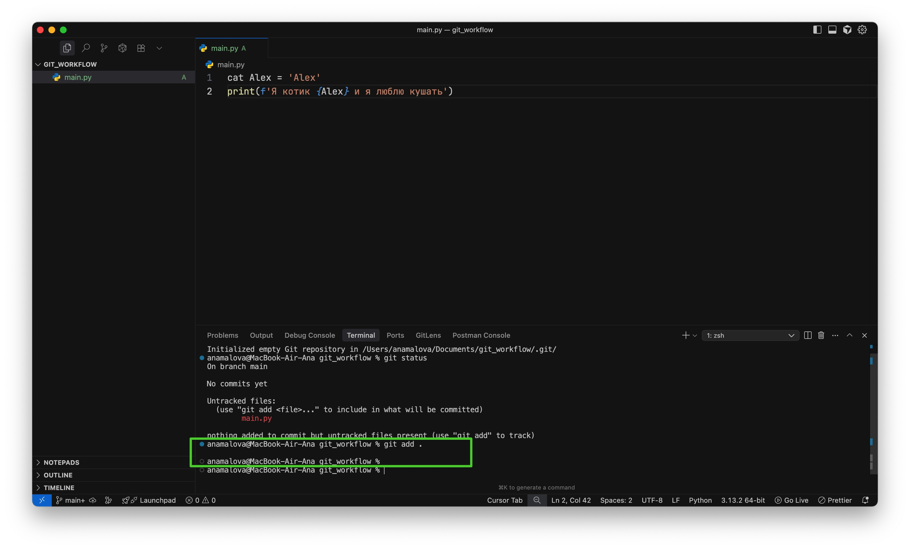

Пустой вывод после выполнения команды говорит о том, что все прошло хорошо.

Посмотрим, что теперь говорит статус:
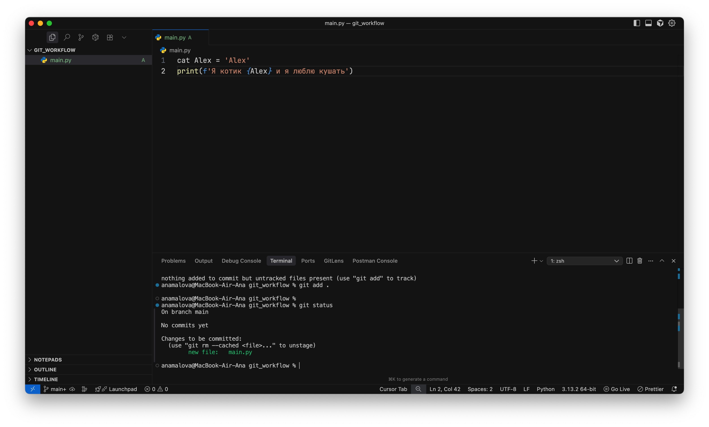

Отлично, теперь файлы отслеживаются гитом и мы можем их закоммитить.

Для этого воспользуемся командой `git commit -m "Здесь может быть любой текст, описывающий, какие изменения вы внесли в файлы"`
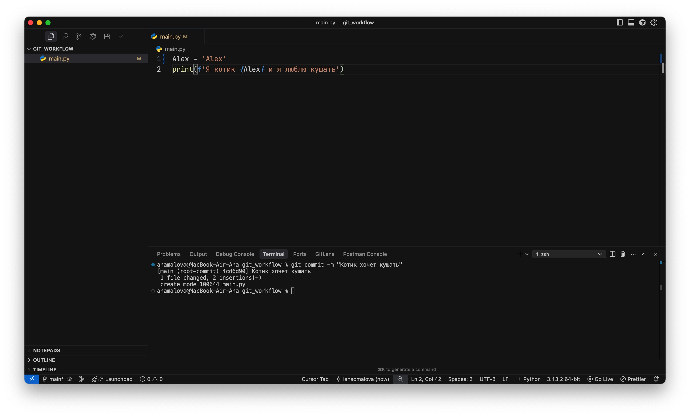

И снова посмотрим на статус:
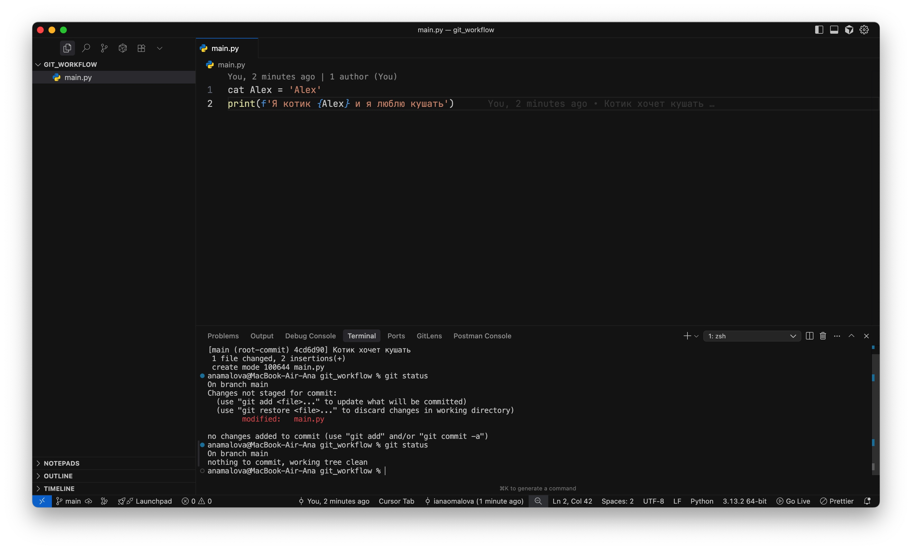
Все чисто, отлично сработано. Все файлы закомичены.

На этом этапе должен был возникнуть резонный вопрос, а зачем собственно мы это сделали.

Преимущество первое - теперь мы можем запушить наш проект на удаленный репозиторий. Вам это очень пригодится, когда вы будете делать ЛР и вам необходимо будет отправить ваш код душному преподавателю на проверку.

### Публикация репозитория в GitHub

Для начала вам нужно создать этот самый удаленный репозиторий. Для этих целей можно воспользоваться GitHub или GitLub.

Рассмотрим на примере GitHub: https://github.com

Перед началом работы зарегистрируйтесь на этом сайте.

Далее на сайте гитхаба находите раздел "Репозитории" и находите кнопочку "New":
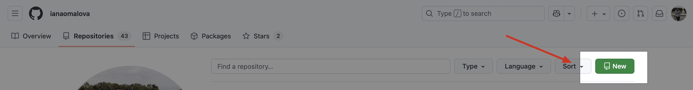

Жмакаете на кнопочку и у вас открывается страница для заполнения данных для вашего репозитория.

На данном этапе просто указывайте имя и сохраняйте репозиторий (зеленая кнопочка Create снизу)
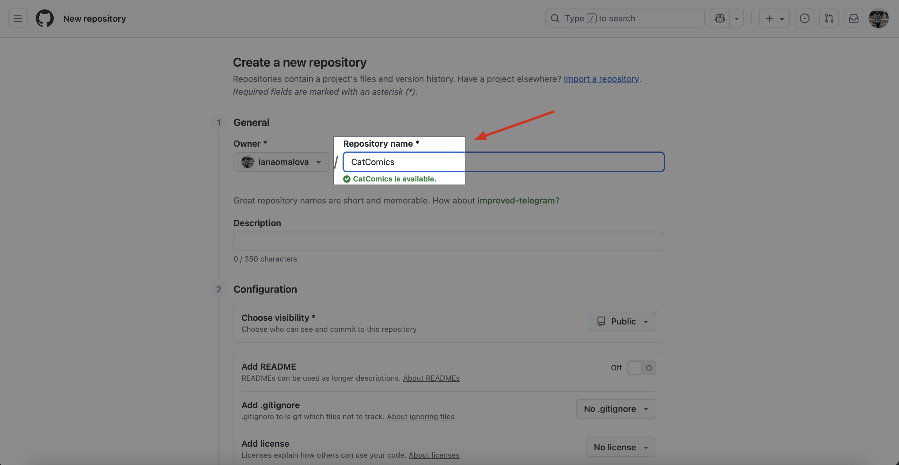

После сохранения вы увидите страницу с разной информацией. Здесь вам нужно будет скопировать ссылку на ваш репозиторий:
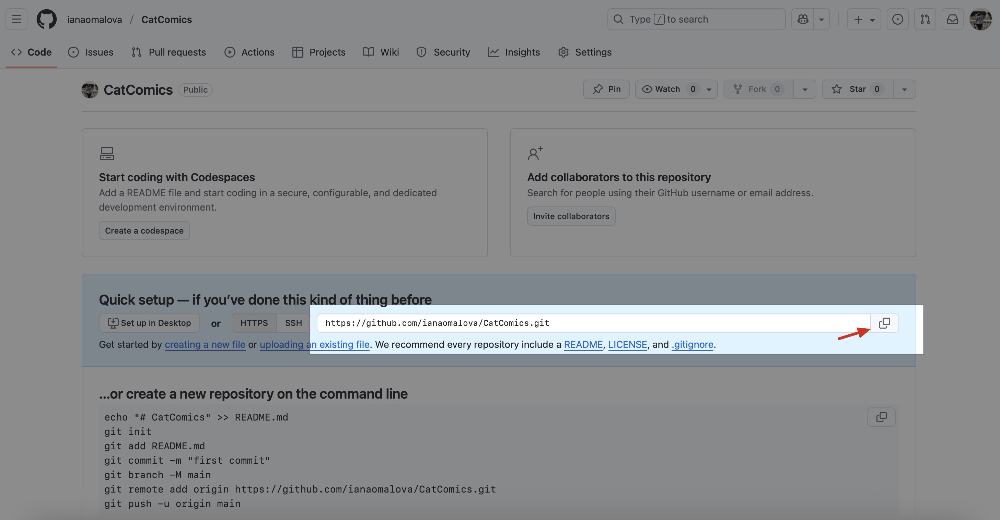

Теперь нам нужно как-то связать наш локальный и только что созданный удаленный репозиторий. Для этого воспользуемся командой `git remote add origin <Ваша ссылка на репозиторий>`
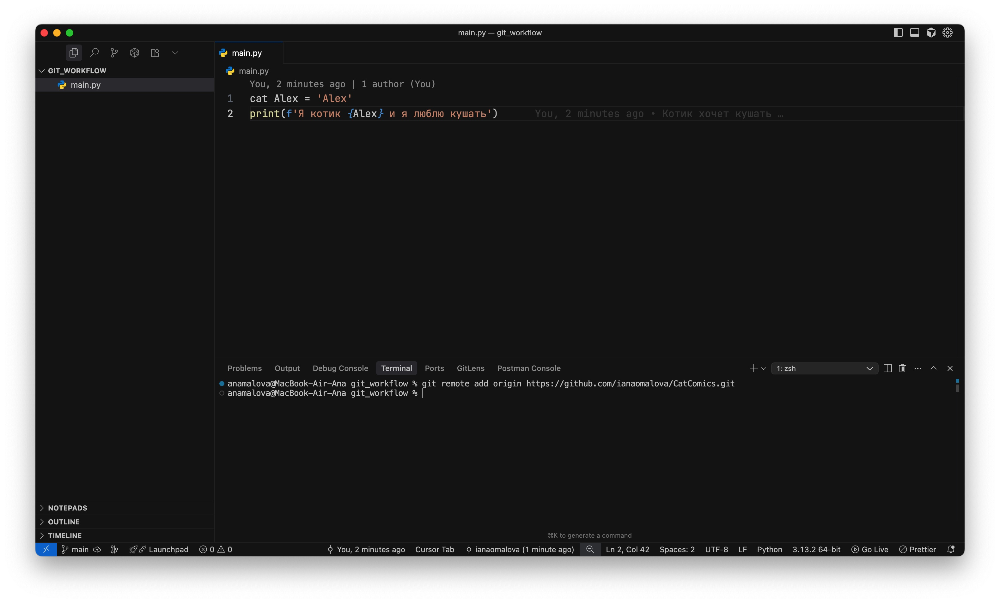

И, момент истины. Теперь мы можем отправить нашего жаждующего кушать котика в удаленный репозиторий на Github.

Для этого используем команду `git push origin main`
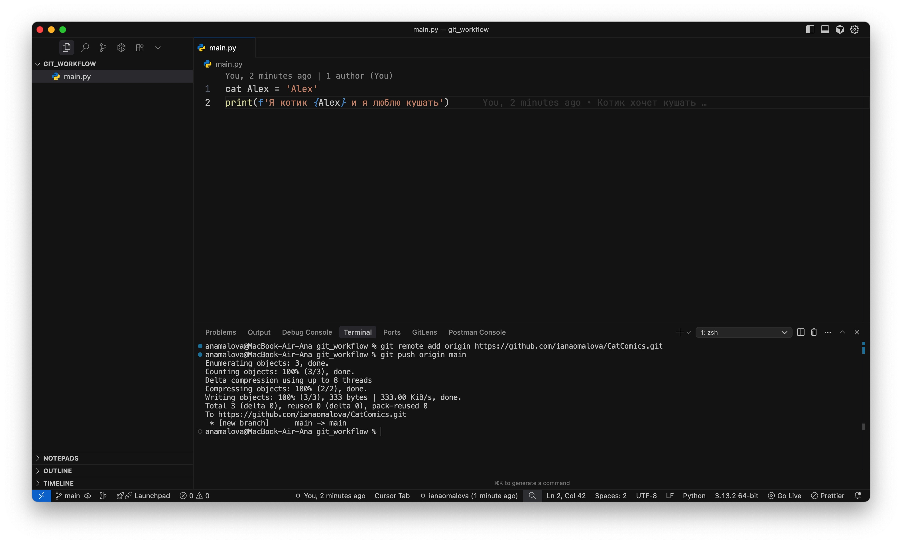

Теперь если вы посмотрите в ваш репозиторий в гитхабе, вы увидите этот самый коммит:
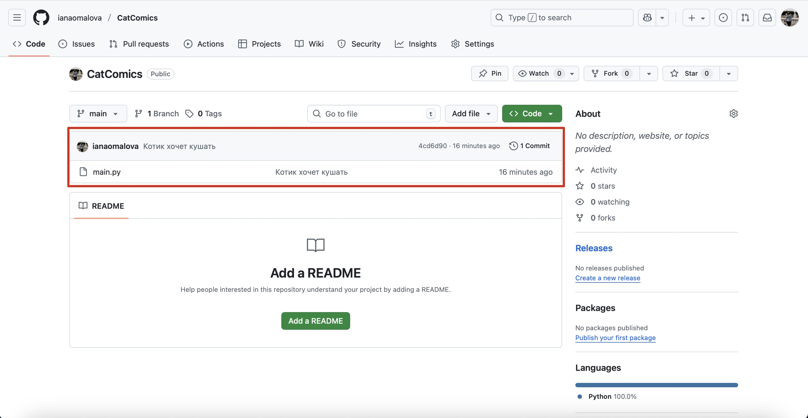

Поздравляю, теперь вы можете гордо отправить лабу на проверку преподу.

Если вам стало смешно с мема, поздравляю, вы почти изучили гит. Если мем не понят, вернитесь к началу страницы и перечитайте команды


### Исправление багов

Но что делать, если вы обнаружили ошибку в коде? Например, лишнее слово "Alex" после названия переменной

Не беда, некий Егор Б. берет и удаляет из файла лишнее. После этого файл окрашивается в оранжевый цвет, а статус говорит о том, что у нас есть модифицированный файл:
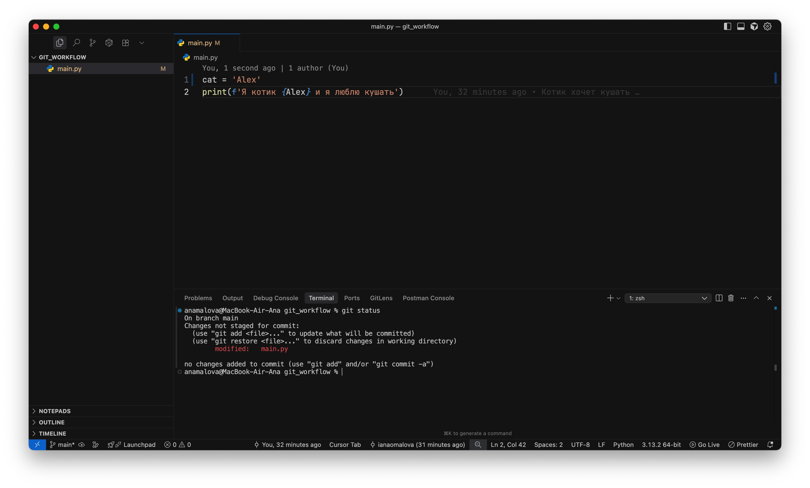

Чтобы решить проблему, нужно сделать 2 вещи:

- Снова добавить файл (git add)
- Снова сделать коммит (git commit)

Но, так как гит уже знает, что файл существует (это не новый добавленный файл, а старый модифицированный), можно сократить 2 команды до одной `git commit -a -m "Умное описание коммита"`:
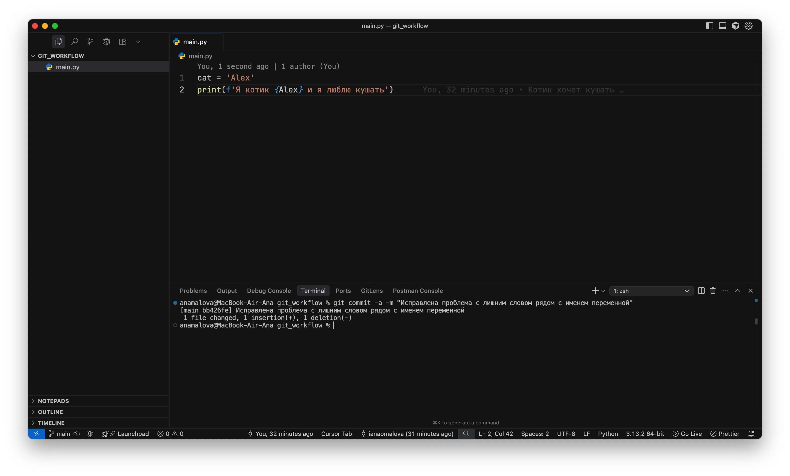

Ну и наконец, нужно показать преподу, какой вы молодец и исправили багу. Для этого нужно снова отправить изменения в удаленный репозиторий командой `git push origin main`

После этого можете открыть свой профиль в гитхабе и первую зеленую точку на плитке

